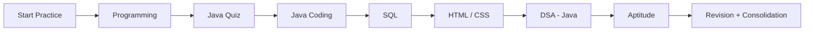

# Academy Practice Archive

<p align="center">
  
  
  
  
</p>

A premium, structured repository of coding practice, MCQ revision, and assessment work from TAP Academy.

This archive organizes learning by topic, module, and assessment area so you can revise quickly, track your progress, and keep your practice material clean and searchable.

## Featured tracks

<div align="center">

| Track | Focus | Status |
| --- | --- | --- |
| Programming | Core coding fundamentals and problem solving | Active |
| Java Quiz | MCQ-based Java revision | Active |
| Java Coding Scenarios | Real-world Java problem solving | Active |
| SQL | Query writing and database practice | Active |
| HTML | Front-end markup fundamentals | Active |
| CSS | Styling and layout practice | Active |
| DSA - Java | Data structures and algorithms | Active |
| Aptitude | Reasoning and assessment prep | Active |

</div>

## Why this repository exists

This archive is designed for:

- fast topic-wise revision
- daily coding practice
- MCQ explanation review
- clean portfolio-style archiving
- structured preparation across multiple tracks

## Learning snapshot

<div align="center">

| Area | Coverage |
| --- | --- |
| Programming modules | 16 major modules |
| Java Quiz sections | 19 topic groups |
| SQL practice | assessment-based question sets |
| Front-end tracks | HTML + CSS modules |
| DSA track | advanced Java problem sets |
| Aptitude track | reasoning and quiz practice |

</div>

## Repository structure

```text
Academy_Daily_Practice_Solutions/
├── 01_Programming Assessment/
│   ├── 01_Data Types/
│   ├── 02_If Else/
│   ├── 03_Loops/
│   ├── 04_Array Traversal V10/
│   ├── 05_Array Traversal V20/
│   ├── 06_Array Pairs/
│   ├── 07_Sorted Array/
│   ├── 08_Subarrays/
│   ├── 09_Multiple Arrays/
│   ├── 10_Arrays Miscellaneous/
│   ├── 11_String Traversal/
│   ├── 12_String Manipulation/
│   ├── 13_Substrings/
│   ├── 14_Word Manipulation/
│   ├── 15_Sets/
│   └── 16_Maps/
├── 02_Java Quiz Assessment/
│   ├── 01_Evolution of HLL/
│   ├── 02_Object Orientation/
│   ├── 03_Main Method/
│   ├── 04_Methods/
│   ├── 05_Pattern Programming/
│   ├── 06_DataTypes/
│   ├── 07_Operators/
│   ├── 08_Arrays/
│   ├── 09_Strings/
│   ├── 10_Method overloading/
│   ├── 11_Encapsulation/
│   ├── 12_Constructors/
│   ├── 13_Static/
│   ├── 14_Inheritances/
│   ├── 15_Polymorphism/
│   ├── 16_Abstraction/
│   ├── 17_Interfaces/
│   ├── 18_Exception Handling/
│   └── 19_Multi threading/
├── 03_Java Coding Scenarios/
├── 04_SQL Assessment/
├── 05_HTML Assessment/
├── 06_CSS Assessment/
├── 07_Data Structures & Algorithms - Java/
├── 08_Aptitude Assessment/
├── README.md
└── .git/
```

## Progress roadmap



## Question format

Each question is organized in its own folder with a consistent layout.

```text
01_Programming Assessment/
└── 01_Data Types/
    └── Add 2 Integers/
        ├── Question.md
        └── Solution.java
```

### Coding questions

Coding folders usually include:

- `Question.md` — description, input format, output format, constraints, sample cases
- `Solution.java` or `Solution.py` — working implementation

### MCQ / quiz questions

Quiz folders typically contain:

- `Question.md` — prompt, answer choices, result summary, explanation

## Example problem page

```md
# Add 2 Integers

## Description
Given two integers, add them and print the result.

## Input Format
The first line contains two integers A and B.

## Output Format
Print the sum of the two integers.

## Constraints
-1000 <= A, B <= 1000

## Sample Cases
### Sample Case 1
**Input**
```text
4 5
```

**Output**
```text
9
```
```

## How to use this repository

1. Pick a track you want to revise.
2. Open the right module folder.
3. Read the question page first.
4. Try solving it before viewing the implementation.
5. Compare your logic with the code and practice again.

## Suggested study flow

- Week 1: Programming + Java Quiz
- Week 2: Coding scenarios + SQL
- Week 3: HTML + CSS + DSA
- Week 4: Aptitude + revision cycles

## Best practices

- Solve one module at a time.
- Revisit older questions weekly.
- Focus on understanding logic rather than memorizing code.
- Use `Question.md` as your summary before solving again.

## Notes

- This archive is intended for personal learning and structured revision.
- It preserves coding metadata in a clean GitHub-friendly structure.
- MCQ pages remain easy to read and revise without the portal UI.

## License

This repository is intended for educational and personal practice use.

---

Built for consistent, structured, and premium daily learning.
